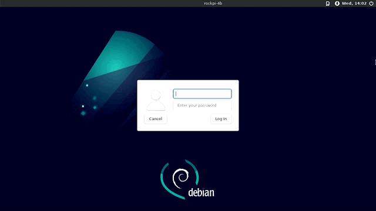

# 

This giude will take you through how to install Debian on a Rock 4 SE and make some tweeks. The tweeks are to support Home Asssistant, but even if you're not planning to use Home Assitant you may find them usful, particularly if you want to run docker or app armor.

The approach taken includes two things that are less common in other tutoruals:

Firstly, installing a custom kernal and changing kernal parameters. 

Sceond, getting ssh access to the board early as possible, which will allow you to configure it from another machine, which is easier than juggling an extra keyboard, mouse and screen. 


## Steps

1. **Download** 

   Get the official image for your board from radxa.com [here](https://wiki.radxa.com/Rockpi4/downloads). Choose the Debian 11 / Kernal 4.4 version and flash it to an SD cardusing balenaEtcher.

2. **Connect**

   Connect the following to your board:

   * USB Keyboard
   * USB Mouse
   * HDMI monitor
   * USB-C Power
   * SD Card
   
3. **Boot and Secure**. 

   Green power LED should be on, blue acticity LED should blink. There will be no HDMI signal but wait 2-3 minuets for the XFCE Desktop.

   * Login

     Default credietials (rock / rock).

   * Open a terminal 
   
   * Change your password
   
     ```
     passwd rock
     ```

     


4. **Connectivity** 
   
   In the same teriminal make sure your Rock board can connext to the internet and you can connect to it from another machine.

   * WiFi (Optional)
   
     If you're not using a wired network, or you just want WiFi too, connect with:
     ```
     sudo nmcli r wifi on
     sudo nmcli dev wifi connect "<ssid>" password "<password>"
     ```

   * Find the machine's ip address
     ```
     hostname -I
     ```

      We'll use an example ip address of `192.168.1.9`

   * Check connectivity

     Ping google:

     ```
     ping google.com
     ```

     From another machine, ping your board:

     ```
     ping 192.168.1.9
     ```


5. **Configure** your system

   Now your Rock board is connected to your local network you can take the followig steps from another machine. Working from your normal desktop / laptop may be more efficient and I find it much easier for copying and pasting commands.

   From another machine:

   * Setup SSH Keys

     This helps speed up `ssh`ing. From anothe machine (e.g. your desktop or laptop) run:
     ```
     ssh-keygen
     ssh-copy-id -i ~/.ssh/id_rsa rock@192.168.1.9
     ```

   * SSH to the Rock board
     ```
     ssh rock@192.168.1.9
     ```

   * Update Radxa APT public key
     ```
     sudo apt-get install -y wget
     source /etc/os-release
     export DISTRO="${VERSION_CODENAME}-stable"
     wget -O - apt.radxa.com/$DISTRO/public.key | sudo apt-key add -
     ```

   * Update the system
     ```
     sudo apt-get update
     sudo apt-get -y --allow-downgrades upgrade 
     ```
   
   * Set timezone
     ```
     timedatectl list-timezones
     sudo timedatectl set-timezone Europe/London
     timedatectl
     ```
   * Set a hostname
   
     It's nice to give your machine a hostname e.g. *homeassistant*. We won't do this using full blown DNS but the following works using mDNS (via avahi, which is installed by default).

     ```
     sudo hostnamectl --static set-hostname homeassistant
     sudo sed -i '2i 127.0.0.1 homeassistant' /etc/hosts
     sudo sed -i '2i 127.0.0.1 homeassistant.local' /etc/hosts
     ```

    * Reboot and reconnect
      ```
      reboot
      ```
    
      Wait a few minutes then check you can still `ssh` to the ip address.
      
      ```
      ssh rock@192.168.1.9
      exit
      ```
      You maym need to wait a bit longer and retry this a few times but eventually avahi mDNS should do it's thing and you will be able to connect using the hostname:

      ```
      ssh rock@homeassistant.local
      ```

## Conclusion and Next Steps

You now have a Debian, docker and some kernal evel tweeks on a Rock 4 SE!

Consider [installing Home Assistant](ha_on_rock_4_se.md)  next.

## References

* [Rock 4 SE](https://www.okdo.com/getting-started/get-started-with-rock-4-se-and-debian/) (on OKdo.com)
* [Rock 4C+](https://www.okdo.com/getting-started/get-started-with-rock-4c-single-board-computer-debian/) (on OKdo.com)
* [Rock 4 Getting Started](https://wiki.radxa.com/Rockpi4/getting_started) (on radxa.com)
* [Rock 4 Debian](https://wiki.radxa.com/Rock4/Debian) 
* [Rock 4 FAQ](https://wiki.radxa.com/Rock4/FAQs#Radxa_APT_public_key_is_not_available) (on radxa.com) specially the part about updating the APT public key)
* [Rock 3 Debian](https://wiki.radxa.com/Rock3/dev/Debian) (on radxa.com) specially the part about kernel deb package